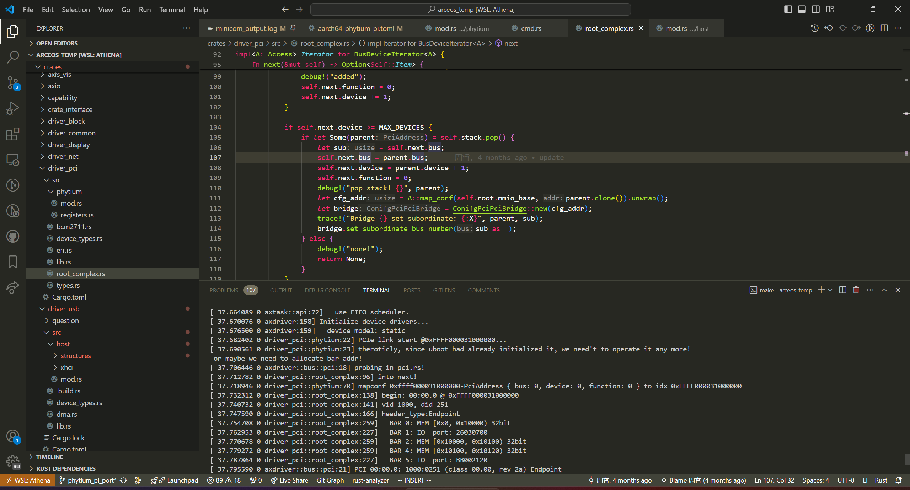

# 最终要解决的问题：xhci控制器目前执行AddressDevice会Paramater error
* 背景：目前我们正在编写xhci控制器/usb的驱动，当进行到获取设备描述符以设置端点传输大小前，我们需要为设备进行一次address device，但是很奇怪的是，控制器始终都只会回报paramater error，为了保证不会引入rust代码，我将会把整个流程辅以内存采样的数据描述出来 
* 注意事项：我们所使用的rust代码中，引入了第三方的xhci库来读写寄存器，有些寄存器在程序上的路径可能与xhci文档不一致，但是实际上读写的内存位置是正确的，仅仅只是为了方便重新组织了结构，当遇到这种情况时只关注读写的寄存器的名字即可。
* 约定1：由于飞腾派有两个控制器，我们当前所使用的控制器内存基地址为0x31a0_8000，插入的usb口颜色为蓝色，位置为更靠近cpu那一面哪一个
* 约定2：在下文所给出的内存dump数据中，其格式为小端序，举个例子:

    31...0

0x00

0x04

0x08


## 控制器启动流程：
目前在开发阶段，当系统启动完成后，由用户手动触发xhci控制器的初始化/重新枚举，其过程如下：
1. 将定义好的xhci控制器数据结构映射至内存0x31a0_8000
2. 开始控制器复位
    1. 将operational->usbcmd->run_stop位清零
    2. 等待operational->usbsts->hc_halted=1
    3. 将operational->usbcmd->host_controller_reset位置1
    4. 等待operational->usbcmd->host_controller_reset与controller_not_ready清零
3. 配置slot相关数据结构
   1. 读取capability->hcsparams1->number_of_device_slots获取槽位数量
   2. 将槽位数量赋值给operational->config->max_device_slot_enabled
   3. 创建dcbaa，其内存布局为: u64\[槽位数量+1\]的数组，保证内存4k对齐，无数据同步问题（no cache）
   4. 将dcbaa的首地址赋值给operational->dcbaap
4. 配置scratchpad
   1. 读取capability->hcsparams2->max_scratchpad_buffers以获取单个buffer大小
   2. 创建scratchpad数据结构，在我们的实现中，scratchpad数据结构包含一个地址索引数组与用于保存buffer的二维数组
   3. 其伪代码如下
    ```c
        u64 num_of_buffers = get_buffer_size();
        u64 page_size = 4096;
        u64 index_array[buffer_num] = alloc_nocache_mem();
        u8 buffers[buffer_num][page_size] = alloc_nocache_mem();
        //将每个buffer的首地址存入index_array
    ```
    4. index_array的首地址存入dcbaa[0]
5. 配置command ring
    ```c
        u32 command_ring[256][4] = {0}; //单个TRB的大小为u32[4]，在这里我们写死command ring长度为256(按trb个数来计算,从下标1开始数)
        u64 enque_index = 0;
        u64 deque_index = 0;
        u32 cycle_state = 1; //翻转位
        //向command_ring[255] 写入link trb（255为最后一个trb所在的位置）
    ```
    2. 向operational->crcr->command_ring_pointer写入command ring的首地址
    3. 向operational->crcr->ring_cycle_state写入command ring的当前翻转位（即初始值1）
 6. 配置event ring
    ```c
    erst_entry{
        u64 seg_base = /*ring的首地址*/;
        u32 seg_size = /*256，即ring的长度*/;
        u32 reserved = 0;
    }
    event_ring{
        u32 ring[256][4] = {0};
        u64 enque_index = 0;
        u64 deque_index = 0;
        u32 cycle_state = 1;
    }
    //此处保证ring的地址4k对齐
    //初始化以上数据结构
    ```
    2. 将operational->usbcmd->interrupt_enable=0
    3. interrupter_register_set[0]->erstsz=1;
    4. interrupter_register_set[0]->event_ring_deque_pointer=ring的首地址;
    5. interrupter_register_set[0]->erstba=erst_entry的地址;
    6. interrupter_register_set[0]->imod->interrupt_moderation_interval=0;
    7. interrupter_register_set[0]->imod->interrupt_moderation_counter=0;
    8. 将operational->usbcmd->interrupt_enable=1
    9. 至此事件环配置完成，但是由于pcie没有初始化，中断传递不出去，我们只能使用轮询的方式来获取事件
7.  创建root_hub实例
    1. 从capability->hcsparams1->number_of_ports获取port数量
    2. 为每个port创建数据结构:
    ```c
    root_port{
    u64 root_porrt_id;
    XHCIUSBDevice device=0; //初始为0，此时未创建设备实例
    bool device_inited=false;
    }
    ```
8. operational->usbcmd->run_stop = 1;
9. 等待operational->usbsts->hc_halted=0;
10. 枚举ROOT_HUB下的端口，进行usb设备配置

## ROOT_HUB设备枚举过程
对root_port中的每个port

如果port_register_set[root_port_id]->portsc->current_connect_status = 1
1. 进行复位:
    ```c
    port_register_set[root_port_id]->portsc->port_enabled_disabled=0;
    port_register_set[root_port_id]->portsc->port_reset=1;
    while (!port_register_set[root_port_id]->portsc->port_reset_change){}
    ```
    此时可dump出port寄存器portsc的状态:
    //todo
2. 从port_register_set[root_port_id]->portsc->port_speed获取速度
3. 创建设备:
    ```c
    XHCIUSBDevice{
    InputContext input;//此处根据xhci规范创建，是64位的格式，依据为capability->hccparams1->read_volatile->context_size=1
    OutputContext output;//同上，保证内存连续且创建时全0
    TransferRing ring;//结构上和control ring一样，包括link trb也是
    port_id = root_port_id;
    slot_id = 0; //此时未分配
    }
    ```
4. 开始设备的初始化 ！重点在这
    1. 向command_ring入队一个EnableSlot TRB,该TRB有效内容如下:
        ```log
        EnableSlot { slot_type: 0, cycle_bit: false }
        ```
        收到连续三个 portStatusChange TRB,请参考[debug日志](./minicom_output.log)第376-392行
    2. 配置slot context
        1. input->control->set_add_context_flag(0)
        2. input->control->set_add_context_flag(1) //此处不是开关，add_context_flag是个数组，此处遵循xhci规范第四章中描述的启动流程置位
    3. input->slot:
        1. 设置root_hub_port_number为当前root_port_id;
        2. 设置route_string=0（为root port, 因此等于0，这一步对不对？）
        3. 设置context_entries=1
    4. endpoint = input->endpoint(dci=1) //0号，即控制端点
        1. endpoint->type = Type::Control
        2. endpoint->max_packet_size = 当前port_speed寄存器所对应的速度，具体来说，这是硬件上握手后得到的，仅仅是暂时的，问题也出在这里
        3. endpoint->max_burst_size=0
        4. endpoint->tr_deque_pointer = //本设备所持有的传输环的首地址
        5. endpoint->cycle_state = //本设备所持有的传输环的cycle_bit，默认为1
        6. endpoint->interval=0
        7. endpoint->max_primary_streams=0
        8. endpoint->mult=0
        9. endpoint->error_count=0
    5. assign_device，即---将output的地址放入dcbaa[slot_id]中
    6. address_device：向command_ring写入Address_device TRB，TRB结构如下：
    ```log
    AddressDevice(AddressDevice { input_context_pointer: (指向Input context的指针), block_set_address_request: false, slot_id: 1, cycle_bit: true })
    ```
    所收到的回复为：
    ```log
    CommandCompletion(CommandCompletion { completion_code: Ok(ParameterError), command_trb_pointer: (指向AddressDevice TRB的指针), command_completion_parameter: 0, vf_id: 0, slot_id: 1, cycle_bit: true })
    ```
    注:此处的pointer是十进制,且TRB内reserved部分为全0
## 附加内容
1. input context的内存结构(为64位的结构，因此要更长一些，此处仅展示input control context,slot和endpoint 0的内容):
```log
offset: 0x00: 00000000000000000000000000000000                                                                                                                                  
offset: 0x04: 00000000000000000000000000000011                                                                                                                                  
offset: 0x08: 00000000000000000000000000000000                                                                                                                                  
offset: 0x0c: 00000000000000000000000000000000                                                                                                                                  
offset: 0x10: 00000000000000000000000000000000                                                                                                                                  
offset: 0x14: 00000000000000000000000000000000                                                                                                                                  
offset: 0x18: 00000000000000000000000000000000                                                                                                                                  
offset: 0x1c: 00000000000000000000000000000000                                                                                                                                  
offset: 0x20: 00000000000000000000000000000000                                                                                                                                  
offset: 0x24: 00000000000000000000000000000000                                                                                                                                  
offset: 0x28: 00000000000000000000000000000000                                                                                                                                  
offset: 0x2c: 00000000000000000000000000000000                                                                                                                                  
offset: 0x30: 00000000000000000000000000000000                                                                                                                                  
offset: 0x34: 00000000000000000000000000000000                                                                                                                                  
offset: 0x38: 00000000000000000000000000000000                                                                                                                                  
offset: 0x3c: 00000000000000000000000000000000                                                                                                                                  
offset: 0x40: 00001000000000000000000000000000                                                                                                                                  
offset: 0x44: 00000000000000010000000000000000                                                                                                                                  
offset: 0x48: 00000000000000000000000000000000                                                                                                                                  
offset: 0x4c: 00000000000000000000000000000000                                                                                                                                  
offset: 0x50: 00000000000000000000000000000000                                                                                                                                  
offset: 0x54: 00000000000000000000000000000000                                                                                                                                  
offset: 0x58: 00000000000000000000000000000000                                                                                                                                  
offset: 0x5c: 00000000000000000000000000000000                                                                                                                                  
offset: 0x60: 00000000000000000000000000000000                                                                                                                                  
offset: 0x64: 00000000000000000000000000000000                                                                                                                                  
offset: 0x68: 00000000000000000000000000000000                                                                                                                                  
offset: 0x6c: 00000000000000000000000000000000                                                                                                                                  
offset: 0x70: 00000000000000000000000000000000                                                                                                                                  
offset: 0x74: 00000000000000000000000000000000                                                                                                                                  
offset: 0x78: 00000000000000000000000000000000                                                                                                                                  
offset: 0x7c: 00000000000000000000000000000000                                                                                                                                  
offset: 0x80: 00000000000000000000000000000000                                                                                                                                  
offset: 0x84: 00000010000000000000000000100110                                                                                                                                  
offset: 0x88: 10010000000110011011000000000001                                                                                                                                  
offset: 0x8c: 00000000000000000000000000000000                                                                                                                                  
offset: 0x90: 00000000000000000000000000000000                                                                                                                                  
offset: 0x94: 00000000000000000000000000000000                                                                                                                                  
offset: 0x98: 00000000000000000000000000000000                                                                                                                                  
offset: 0x9c: 00000000000000000000000000000000                                                                                                                                  
offset: 0xa0: 00000000000000000000000000000000                                                                                                                                  
offset: 0xa4: 00000000000000000000000000000000                                                                                                                                  
offset: 0xa8: 00000000000000000000000000000000                                                                                                                                  
offset: 0xac: 00000000000000000000000000000000                                                                                                                                  
offset: 0xb0: 00000000000000000000000000000000                                                                                                                                  
offset: 0xb4: 00000000000000000000000000000000                                                                                                                                  
offset: 0xb8: 00000000000000000000000000000000                                                                                                                                  
offset: 0xbc: 00000000000000000000000000000000
```
2. output context（即device）的内存结构:
```log
offset: 0x00: 00000000000000000000000000000000                                                                                                                                  
offset: 0x04: 00000000000000000000000000000000                                                                                                                                  
offset: 0x08: 00000000000000000000000000000000                                                                                                                                  
offset: 0x0c: 00000000000000000000000000000000                                                                                                                                  
offset: 0x10: 00000000000000000000000000000000                                                                                                                                  
offset: 0x14: 00000000000000000000000000000000                                                                                                                                  
offset: 0x18: 00000000000000000000000000000000                                                                                                                                  
offset: 0x1c: 00000000000000000000000000000000                                                                                                                                  
offset: 0x20: 00000000000000000000000000000000                                                                                                                                  
offset: 0x24: 00000000000000000000000000000000                                                                                                                                  
offset: 0x28: 00000000000000000000000000000000                                                                                                                                  
offset: 0x2c: 00000000000000000000000000000000                                                                                                                                  
offset: 0x30: 00000000000000000000000000000000                                                                                                                                  
offset: 0x34: 00000000000000000000000000000000                                                                                                                                  
offset: 0x38: 00000000000000000000000000000000                                                                                                                                  
offset: 0x3c: 00000000000000000000000000000000                                                                                                                                  
offset: 0x40: 00000000000000000000000000000000                                                                                                                                  
offset: 0x44: 00000000000000000000000000000000                                                                                                                                  
offset: 0x48: 00000000000000000000000000000000                                                                                                                                  
offset: 0x4c: 00000000000000000000000000000000                                                                                                                                  
offset: 0x50: 00000000000000000000000000000000                                                                                                                                  
offset: 0x54: 00000000000000000000000000000000                                                                                                                                  
offset: 0x58: 00000000000000000000000000000000                                                                                                                                  
offset: 0x5c: 00000000000000000000000000000000                                                                                                                                  
offset: 0x60: 00000000000000000000000000000000                                                                                                                                  
offset: 0x64: 00000000000000000000000000000000                                                                                                                                  
offset: 0x68: 00000000000000000000000000000000                                                                                                                                  
offset: 0x6c: 00000000000000000000000000000000                                                                                                                                  
offset: 0x70: 00000000000000000000000000000000                                                                                                                                  
offset: 0x74: 00000000000000000000000000000000                                                                                                                                  
offset: 0x78: 00000000000000000000000000000000                                                                                                                                  
offset: 0x7c: 00000000000000000000000000000000
```
是的，竟然是全0

## 猜想1
很简单，既然output全0，那说明device并没有回复消息，也就是说可能dcbaa/scratchpad的分配有误（地址经验证，正确）
## 猜想2
由于pcie没有枚举，导致xhci控制器无法从bar中获取自己的mmio空间信息，从而无法为设备分配内存，因此出现了paramater error（但是我们的系统是uboot引导的，在uboot中已经通过usb start枚举过一次设备，既然如此，bar难道不应该已经配好了？
另外，我们目前枚举0x4000_0000的pcie ecam空间，仅仅只能找到

PCI 00:01.0: 1DB7:DC01 (class 06.04, rev 00) PciPciBridge

剩下的就找不到任何设备了，能否发一份最精简的枚举pci总线以配置xhci控制器的代码？sdk中提供的例程过于混乱，且难以调试。

## 疑问1
pcie控制器的ecam空间是否有误？xhci控制器的基地址是0x31a0_8000，如果仔细想一下可以发现(也可能是我想多了),后面的8000很像是pci的bdf中 device=1的偏移，而当我将pci扫描的起始地址设置到0x3100_0000时，还真的能扫出来一些endpoint设备，是内存中数据分布造成的巧合嘛？



## 备注
如需要远程连线调试请告知。