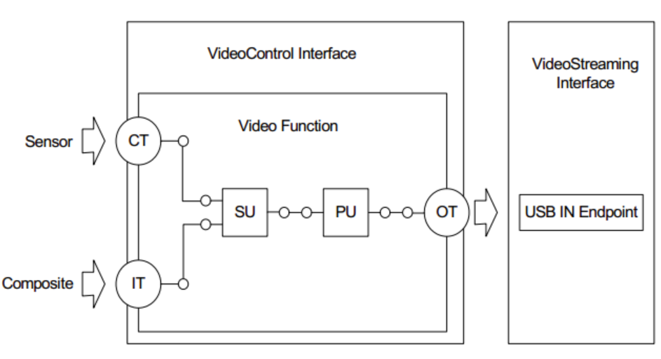
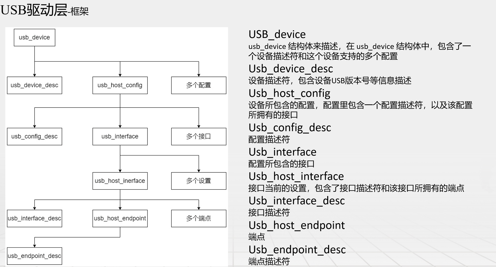
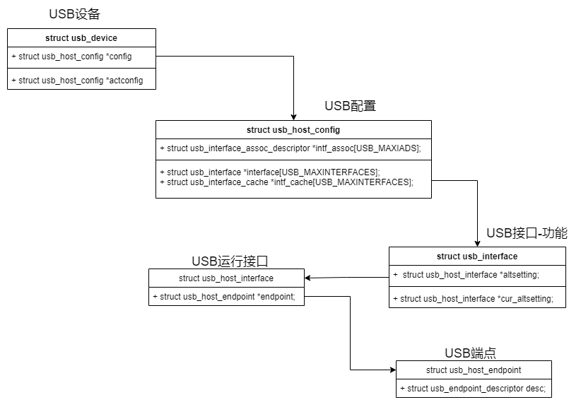

# Linux系统UVC相关驱动分析

#### V1.0

## 驱动分析

### UVC摄像头设备拓扑结构



#### IT（Input Terminal）UVC输入端点

作为数据流入video function的接收器，功能是作为已经被提取出来的数据的数据源，即UVC功能的数据源头。

#### OT（Output Terminal）UVC输出端点

作为Video Function视频信息流出的出口，功能是作为输出数据的接收器。

#### CT（Camera Terminal）

代表硬件上的数据采集源(sensor),用于控制视频流传输中的设备特性的。它规定支持以下特性控制：

- 扫描模式(逐行扫描或隔行扫描)
- 自动曝光模式
- 自动曝光优先级
- 曝光时间
- 聚焦
- 自动聚焦
- 可变光圈
- 缩放/变焦
- 移动镜头
- 滚动
- 倾斜
- 数字窗口
- 感兴趣区域

#### SU选择单元

SU单元用来控制图像数据采集源的切换和选择。

#### PU处理单元

对采集所得图像数据进行加工的单元，负责对采集到的图像特性进行调整设置。主要有以下一些特性：

- **用户控制 User Controls**
  - Brightness（背光）
  - Contrast（对比度）
  - Hue（色度）
  - Saturatio（饱和度）
  - Sharpness（锐度）
  - Gamma（伽马）
  - Digital Multiplier (Zoom)（数字放大）
- **自动控制 Auto Controls**
  - White Balance Temperature（白平衡色温）
  - White Balance Component（白平衡组件）
  - Blcklight Compensation（背光补偿）
- **其它 Other**
  - Gain（增益）
  - Power Line Frequency（电源线平率）
  - Analog Video Standard（模拟视频标准）
  - Analog Video Lock Status（模拟视频死锁状态）

### UVC相关代码目录

```
zyz@Rust:~/linux-kernel/linux-6.6.67/drivers/media/usb/uvc$ tree
.
├── Kconfig
├── Makefile
├── uvc_ctrl.c			//处理UVC设备控制请求的代码。处理用户空间控制命令，视频格式、分辨率等
├── uvc_debugfs.c		//查看和修改内核调试信息
├── uvc_driver.c		//包含了UVC驱动程序的主要逻辑，包括初始化、模块加载和卸载、设备注册和注销等
├── uvc_entity.c		//处理UVC实体，即UVC设备中的不同组件，如输入端和输出端
├── uvc_isight.c		//专门处理苹果iSight摄像头的特定功能
├── uvc_metadata.c		//处理UVC流中的元数据，元数据包含了视频流的额外信息，比如时间戳、错误状态等
├── uvc_queue.c			//处理视频数据的队列管理，缓冲区的分配和管理，确保视频数据可以连续稳定地传输
├── uvc_status.c		//处理UVC设备的状态报告，包括错误状态和设备状态的查询
├── uvc_v4l2.c			//实现Video4Linux2（V4L2）接口
├── uvc_video.c			//处理视频捕获的核心功能，包括视频流的初始化、处理和关闭
└── uvcvideo.h			//UVC驱动的头文件，包含了定义、宏、数据结构和函数声明
```

Makefile：

```
# SPDX-License-Identifier: GPL-2.0
uvcvideo-objs  := uvc_driver.o uvc_queue.o uvc_v4l2.o uvc_video.o uvc_ctrl.o \
		  uvc_status.o uvc_isight.o uvc_debugfs.o uvc_metadata.o
ifeq ($(CONFIG_MEDIA_CONTROLLER),y)
uvcvideo-objs  += uvc_entity.o
endif
obj-$(CONFIG_USB_VIDEO_CLASS) += uvcvideo.o
```

### 源码解析

#### UVC驱动初始化入口

```C
static int __init uvc_init(void)
{
	int ret;

	uvc_debugfs_init();

	ret = usb_register(&uvc_driver.driver);
	if (ret < 0) {
		uvc_debugfs_cleanup();
		return ret;
	}

	return 0;
}
```

其中，usb_register(&uvc_driver.driver)的指向为：

```c
/* use a define to avoid include chaining to get THIS_MODULE & friends */
#define usb_register(driver) \
	usb_register_driver(driver, THIS_MODULE, KBUILD_MODNAME)
```

```c
//位于 driver/usb/core/driver.c中
int usb_register_driver(struct usb_driver *new_driver, struct module *owner,
			const char *mod_name)
{
	int retval = 0;

	if (usb_disabled())
		return -ENODEV;

	new_driver->drvwrap.for_devices = 0;
	new_driver->drvwrap.driver.name = new_driver->name;
	new_driver->drvwrap.driver.bus = &usb_bus_type;
	new_driver->drvwrap.driver.probe = usb_probe_interface;
	new_driver->drvwrap.driver.remove = usb_unbind_interface;
	new_driver->drvwrap.driver.owner = owner;
	new_driver->drvwrap.driver.mod_name = mod_name;
	new_driver->drvwrap.driver.dev_groups = new_driver->dev_groups;
	spin_lock_init(&new_driver->dynids.lock);
	INIT_LIST_HEAD(&new_driver->dynids.list);

	retval = driver_register(&new_driver->drvwrap.driver);
	if (retval)
		goto out;

	retval = usb_create_newid_files(new_driver);
	if (retval)
		goto out_newid;

	pr_info("%s: registered new interface driver %s\n",
			usbcore_name, new_driver->name);

out:
	return retval;

out_newid:
	driver_unregister(&new_driver->drvwrap.driver);

	pr_err("%s: error %d registering interface driver %s\n",
		usbcore_name, retval, new_driver->name);
	goto out;
}
```

其注册信息如下：

```c
struct uvc_driver uvc_driver = {
	.driver = {
		.name		= "uvcvideo",
		.probe		= uvc_probe,
		.disconnect	= uvc_disconnect,
		.suspend	= uvc_suspend,
		.resume		= uvc_resume,
		.reset_resume	= uvc_reset_resume,
		.id_table	= uvc_ids,
		.supports_autosuspend = 1,
	},
};
```

其中uvc_probe为UVC摄像头设备初始化函数

#### uvc_probe初始化函数解析

```C
static int uvc_probe(struct usb_interface *intf,
		     const struct usb_device_id *id)
{
	struct usb_device *udev = interface_to_usbdev(intf);
	struct uvc_device *dev;
	const struct uvc_device_info *info =
		(const struct uvc_device_info *)id->driver_info;
	int function;
	int ret;

	/* Allocate memory for the device and initialize it. */
	dev = kzalloc(sizeof(*dev), GFP_KERNEL);
	if (dev == NULL)
		return -ENOMEM;

	INIT_LIST_HEAD(&dev->entities);
	INIT_LIST_HEAD(&dev->chains);
	INIT_LIST_HEAD(&dev->streams);
	kref_init(&dev->ref);
	atomic_set(&dev->nmappings, 0);
	mutex_init(&dev->lock);

	dev->udev = usb_get_dev(udev);
	dev->intf = usb_get_intf(intf);
	dev->intfnum = intf->cur_altsetting->desc.bInterfaceNumber;
	dev->info = info ? info : &uvc_quirk_none;
	dev->quirks = uvc_quirks_param == -1
		    ? dev->info->quirks : uvc_quirks_param;

	if (id->idVendor && id->idProduct)
		uvc_dbg(dev, PROBE, "Probing known UVC device %s (%04x:%04x)\n",
			udev->devpath, id->idVendor, id->idProduct);
	else
		uvc_dbg(dev, PROBE, "Probing generic UVC device %s\n",
			udev->devpath);

	if (udev->product != NULL)
		strscpy(dev->name, udev->product, sizeof(dev->name));
	else
		snprintf(dev->name, sizeof(dev->name),
			 "UVC Camera (%04x:%04x)",
			 le16_to_cpu(udev->descriptor.idVendor),
			 le16_to_cpu(udev->descriptor.idProduct));

	/*
	 * Add iFunction or iInterface to names when available as additional
	 * distinguishers between interfaces. iFunction is prioritized over
	 * iInterface which matches Windows behavior at the point of writing.
	 */
	if (intf->intf_assoc && intf->intf_assoc->iFunction != 0)
		function = intf->intf_assoc->iFunction;
	else
		function = intf->cur_altsetting->desc.iInterface;
	if (function != 0) {
		size_t len;

		strlcat(dev->name, ": ", sizeof(dev->name));
		len = strlen(dev->name);
		usb_string(udev, function, dev->name + len,
			   sizeof(dev->name) - len);
	}

	/* Initialize the media device. */
#ifdef CONFIG_MEDIA_CONTROLLER
	dev->mdev.dev = &intf->dev;
	strscpy(dev->mdev.model, dev->name, sizeof(dev->mdev.model));
	if (udev->serial)
		strscpy(dev->mdev.serial, udev->serial,
			sizeof(dev->mdev.serial));
	usb_make_path(udev, dev->mdev.bus_info, sizeof(dev->mdev.bus_info));
	dev->mdev.hw_revision = le16_to_cpu(udev->descriptor.bcdDevice);
	media_device_init(&dev->mdev);

	dev->vdev.mdev = &dev->mdev;
#endif

	/* Parse the Video Class control descriptor. */
	if (uvc_parse_control(dev) < 0) {
		uvc_dbg(dev, PROBE, "Unable to parse UVC descriptors\n");
		goto error;
	}

	/* Parse the associated GPIOs. */
	if (uvc_gpio_parse(dev) < 0) {
		uvc_dbg(dev, PROBE, "Unable to parse UVC GPIOs\n");
		goto error;
	}

	dev_info(&dev->udev->dev, "Found UVC %u.%02x device %s (%04x:%04x)\n",
		 dev->uvc_version >> 8, dev->uvc_version & 0xff,
		 udev->product ? udev->product : "<unnamed>",
		 le16_to_cpu(udev->descriptor.idVendor),
		 le16_to_cpu(udev->descriptor.idProduct));

	if (dev->quirks != dev->info->quirks) {
		dev_info(&dev->udev->dev,
			 "Forcing device quirks to 0x%x by module parameter for testing purpose.\n",
			 dev->quirks);
		dev_info(&dev->udev->dev,
			 "Please report required quirks to the linux-media mailing list.\n");
	}

	if (dev->info->uvc_version) {
		dev->uvc_version = dev->info->uvc_version;
		dev_info(&dev->udev->dev, "Forcing UVC version to %u.%02x\n",
			 dev->uvc_version >> 8, dev->uvc_version & 0xff);
	}

	/* Register the V4L2 device. */
	if (v4l2_device_register(&intf->dev, &dev->vdev) < 0)
		goto error;

	/* Scan the device for video chains. */
	if (uvc_scan_device(dev) < 0)
		goto error;

	/* Initialize controls. */
	if (uvc_ctrl_init_device(dev) < 0)
		goto error;

	/* Register video device nodes. */
	if (uvc_register_chains(dev) < 0)
		goto error;

#ifdef CONFIG_MEDIA_CONTROLLER
	/* Register the media device node */
	if (media_device_register(&dev->mdev) < 0)
		goto error;
#endif
	/* Save our data pointer in the interface data. */
	usb_set_intfdata(intf, dev);

	/* Initialize the interrupt URB. */
	ret = uvc_status_init(dev);
	if (ret < 0) {
		dev_info(&dev->udev->dev,
			 "Unable to initialize the status endpoint (%d), status interrupt will not be supported.\n",
			 ret);
	}

	ret = uvc_gpio_init_irq(dev);
	if (ret < 0) {
		dev_err(&dev->udev->dev,
			"Unable to request privacy GPIO IRQ (%d)\n", ret);
		goto error;
	}

	if (dev->quirks & UVC_QUIRK_NO_RESET_RESUME)
		udev->quirks &= ~USB_QUIRK_RESET_RESUME;

	if (!(dev->quirks & UVC_QUIRK_DISABLE_AUTOSUSPEND))
		usb_enable_autosuspend(udev);

	uvc_dbg(dev, PROBE, "UVC device initialized\n");

	return 0;

error:
	uvc_unregister_video(dev);
	kref_put(&dev->ref, uvc_delete);
	return -ENODEV;
}
```

1. **参数分析：**

   ```C
   static int uvc_probe(struct usb_interface *intf,
   		     const struct usb_device_id *id)
   ```

   - **参数一：usb_interface类型指针**

     根据USB协议实现为：

     

     其中：

     

     **struct usb_device USB设备**

     usb_device代表着一个USB设备。其结构体定义如下

     ```
     struct usb_device {
     	int		devnum;
     	char		devpath[16];
     	u32		route;
     	enum usb_device_state	state;
     	enum usb_device_speed	speed;
     	unsigned int		rx_lanes;
     	unsigned int		tx_lanes;
     	enum usb_ssp_rate	ssp_rate;

     	struct usb_tt	*tt;
     	int		ttport;

     	unsigned int toggle[2];

     	struct usb_device *parent;
     	struct usb_bus *bus;
     	struct usb_host_endpoint ep0;

     	struct device dev;

     	struct usb_device_descriptor descriptor;
     	struct usb_host_bos *bos;
     	struct usb_host_config *config;

     	struct usb_host_config *actconfig;
     	struct usb_host_endpoint *ep_in[16];
     	struct usb_host_endpoint *ep_out[16];

     	char **rawdescriptors;

     	unsigned short bus_mA;
     	u8 portnum;
     	u8 level;
     	u8 devaddr;

     	unsigned can_submit:1;
     	unsigned persist_enabled:1;
     	unsigned reset_in_progress:1;
     	unsigned have_langid:1;
     	unsigned authorized:1;
     	unsigned authenticated:1;
     	unsigned lpm_capable:1;
     	unsigned lpm_devinit_allow:1;
     	unsigned usb2_hw_lpm_capable:1;
     	unsigned usb2_hw_lpm_besl_capable:1;
     	unsigned usb2_hw_lpm_enabled:1;
     	unsigned usb2_hw_lpm_allowed:1;
     	unsigned usb3_lpm_u1_enabled:1;
     	unsigned usb3_lpm_u2_enabled:1;
     	int string_langid;

     	/* static strings from the device */
     	char *product;
     	char *manufacturer;
     	char *serial;

     	struct list_head filelist;

     	int maxchild;

     	u32 quirks;
     	atomic_t urbnum;

     	unsigned long active_duration;

     	unsigned long connect_time;

     	unsigned do_remote_wakeup:1;
     	unsigned reset_resume:1;
     	unsigned port_is_suspended:1;

     	int slot_id;
     	struct usb2_lpm_parameters l1_params;
     	struct usb3_lpm_parameters u1_params;
     	struct usb3_lpm_parameters u2_params;
     	unsigned lpm_disable_count;

     	u16 hub_delay;
     	unsigned use_generic_driver:1;
     };
     ```

     **struct usb_host_config 配置**

     usb_host_config用于struct usb_device结构体中设备的配置。

     ```c
     struct usb_host_config {
     	struct usb_config_descriptor	desc;

     	char *string;		/* iConfiguration string, if present */

     	/* List of any Interface Association Descriptors in this
     	 * configuration. */
     	struct usb_interface_assoc_descriptor *intf_assoc[USB_MAXIADS];

     	/* the interfaces associated with this configuration,
     	 * stored in no particular order */
     	struct usb_interface *interface[USB_MAXINTERFACES];

     	/* Interface information available even when this is not the
     	 * active configuration */
     	struct usb_interface_cache *intf_cache[USB_MAXINTERFACES];

     	unsigned char *extra;   /* Extra descriptors */
     	int extralen;
     };

     /* USB2.0 and USB3.0 device BOS descriptor set */
     struct usb_host_bos {
     	struct usb_bos_descriptor	*desc;

     	struct usb_ext_cap_descriptor	*ext_cap;
     	struct usb_ss_cap_descriptor	*ss_cap;
     	struct usb_ssp_cap_descriptor	*ssp_cap;
     	struct usb_ss_container_id_descriptor	*ss_id;
     	struct usb_ptm_cap_descriptor	*ptm_cap;
     };
     ```

     **struct usb_interface 接口函数**

     usb_interface即设备的接口。

     例如：
     一个设备有两种功能 一个键盘 一个音频，两种接口，那这样肯定得要两个驱动程序，一个是键盘驱动程序，一个是音频流驱动程序。两种功能整合在一起称为一个设备。但是不同的接口需要不同的驱动，音频驱动 和键盘驱动。用interface来区分，就有了接口类型。

     ```C
     struct usb_interface {
     	/* array of alternate settings for this interface,
     	 * stored in no particular order */
     	struct usb_host_interface *altsetting;

     	struct usb_host_interface *cur_altsetting;	/* the currently
     					 * active alternate setting */
     	unsigned num_altsetting;	/* number of alternate settings */

     	/* If there is an interface association descriptor then it will list
     	 * the associated interfaces */
     	struct usb_interface_assoc_descriptor *intf_assoc;

     	int minor;			/* minor number this interface is
     					 * bound to */
     	enum usb_interface_condition condition;		/* state of binding */
     	unsigned sysfs_files_created:1;	/* the sysfs attributes exist */
     	unsigned ep_devs_created:1;	/* endpoint "devices" exist */
     	unsigned unregistering:1;	/* unregistration is in progress */
     	unsigned needs_remote_wakeup:1;	/* driver requires remote wakeup */
     	unsigned needs_altsetting0:1;	/* switch to altsetting 0 is pending */
     	unsigned needs_binding:1;	/* needs delayed unbind/rebind */
     	unsigned resetting_device:1;	/* true: bandwidth alloc after reset */
     	unsigned authorized:1;		/* used for interface authorization */
     	enum usb_wireless_status wireless_status;
     	struct work_struct wireless_status_work;

     	struct device dev;		/* interface specific device info */
     	struct device *usb_dev;
     	struct work_struct reset_ws;	/* for resets in atomic context */
     };

     #define to_usb_interface(__dev)	container_of_const(__dev, struct usb_interface, dev)

     static inline void *usb_get_intfdata(struct usb_interface *intf)
     {
     	return dev_get_drvdata(&intf->dev);
     }
     ```

     **struct usb_host_interface配置**

     一个接口可以有多个设置，使用不同的设置，描述接口的信息会有些不同，所以接口描述符并没有放在struct usb_interface结构里，而是放在表示接口设置的struct usb_host_interface结构里。

     ```
     struct usb_host_interface {
     	struct usb_interface_descriptor	desc;

     	int extralen;
     	unsigned char *extra;   /* Extra descriptors */

     	/* array of desc.bNumEndpoints endpoints associated with this
     	 * interface setting.  these will be in no particular order.
     	 */
     	struct usb_host_endpoint *endpoint;

     	char *string;		/* iInterface string, if present */
     };
     ```

     **struct usb_host_endpoint 端点**

     ```c
     struct usb_host_endpoint {
     	struct usb_endpoint_descriptor		desc;
     	struct usb_ss_ep_comp_descriptor	ss_ep_comp;
     	struct usb_ssp_isoc_ep_comp_descriptor	ssp_isoc_ep_comp;
     	struct list_head		urb_list;
     	void				*hcpriv;
     	struct ep_device		*ep_dev;	/* For sysfs info */

     	unsigned char *extra;   /* Extra descriptors */
     	int extralen;
     	int enabled;
     	int streams;
     };
     ```
   - 参数二：usb_device_id指针描述了该USB逻辑设备的基本信息

     ```C
     struct usb_device_id {
     	/* which fields to match against? */
     	__u16		match_flags;

     	/* Used for product specific matches; range is inclusive */
     	__u16		idVendor;
     	__u16		idProduct;
     	__u16		bcdDevice_lo;
     	__u16		bcdDevice_hi;

     	/* Used for device class matches */
     	__u8		bDeviceClass;
     	__u8		bDeviceSubClass;
     	__u8		bDeviceProtocol;

     	/* Used for interface class matches */
     	__u8		bInterfaceClass;
     	__u8		bInterfaceSubClass;
     	__u8		bInterfaceProtocol;

     	/* Used for vendor-specific interface matches */
     	__u8		bInterfaceNumber;

     	/* not matched against */
     	kernel_ulong_t	driver_info
     		__attribute__((aligned(sizeof(kernel_ulong_t))));
     };
     ```
2. **主体分析：**

   在uvc_probe中，进行必要的信息验证后，就应该和Windows驱动调用IoCreateDevice创建本层的设备对象一样，UVC驱动申请本层设备驱动的设备对象结构体。

   ```C
       struct uvc_device *dev;    ...    dev = kzalloc(sizeof(*dev), GFP_KERNEL);
   ```

   对申请的结构体对象进行初始化，并保存该逻辑USB设备对象的相关信息。

   ```C
   INIT_LIST_HEAD(&dev->entities);
   	INIT_LIST_HEAD(&dev->chains);
   	INIT_LIST_HEAD(&dev->streams);
   	kref_init(&dev->ref);
   	atomic_set(&dev->nmappings, 0);
   	mutex_init(&dev->lock);

   	dev->udev = usb_get_dev(udev);
   	dev->intf = usb_get_intf(intf);
   	dev->intfnum = intf->cur_altsetting->desc.bInterfaceNumber;
   	dev->info = info ? info : &uvc_quirk_none;
   	dev->quirks = uvc_quirks_param == -1
   		    ? dev->info->quirks : uvc_quirks_param;
   ```

   UVC规范定义的UVC设备，至少有一个视频控制接口和0个或者多个视频流接口（一般有一个视频接口）

   ```c
   /* Parse the Video Class control descriptor. */  
   if (uvc_parse_control(dev) < 0) {
   	uvc_trace(UVC_TRACE_PROBE, "Unable to parse UVC "
   		"descriptors.\n");  
   	goto error;  
   	}
   ```

   使用uvc_parse_control解析该UVC设备的配置描述符，解析出需要的信息。

   使用v4l2_device_register函数。
   第一个参数intf->dev是LINUX系统层的设备`struct device *dev`。
   第二个V4L2设备，由v4l2_device_register初始化，但其位于struct uvc_device结构体中。

   ```C
   /* Register the V4L2 device. */  
   if (v4l2_device_register(&intf->dev, &dev->vdev) < 0)  
   	goto error;
   ```

   初始化UVC控制接口中的各种Unit或者Terminal,比如UVC扩展单元，UVC相机终端单元，UVC处理单元等，这些支持的UVC特定类请求。

   ```C
   /* Initialize controls. */  
   if (uvc_ctrl_init_device(dev) < 0)  
   	goto error;
   ```

   这一块没看，估计与视频流接口中UVC设备的格式，分辨率等相关。

   ```C
   /* Scan the device for video chains. */  
   if (uvc_scan_device(dev) < 0)   
   	goto error;  
   /* Register video device nodes. */  
   if (uvc_register_chains(dev) < 0)   
   	goto error;
   ```

   将UVC对象保留在USBCore对象给的私有数据成员中。

   ```C
   /* Save our data pointer in the interface data. */  
   usb_set_intfdata(intf, dev);
   ```

   初始化中断状态。这应与UVC控制接口某些设备中有一些中断端点，用于向主机上报其错误状态。

   ```
   /* Initialize the interrupt URB. */  
   if ((ret = uvc_status_init(dev)) < 0) {  
   	uvc_printk(KERN_INFO, "Unable to initialize the status "    
   		"endpoint (%d), status interrupt will not be "    
   			"supported.\n", ret);
   	}
   ```

   设备就绪-自动挂起

   ```
   usb_enable_autosuspend(udev);
   ```

#### uvc_parse_standard_control解析拓扑结构描述符

Linux系统使用uvc_parse_standard_control函数解析标准的UVC描述符。

```C
static int uvc_parse_standard_control(struct uvc_device *dev,
	const unsigned char *buffer, int buflen)
{
	struct usb_device *udev = dev->udev;
	struct uvc_entity *unit, *term;
	struct usb_interface *intf;
	struct usb_host_interface *alts = dev->intf->cur_altsetting;
	unsigned int i, n, p, len;
	const char *type_name;
	u16 type;

	switch (buffer[2]) {
	case UVC_VC_HEADER:
		n = buflen >= 12 ? buffer[11] : 0;

		if (buflen < 12 + n) {
			uvc_dbg(dev, DESCR,
				"device %d videocontrol interface %d HEADER error\n",
				udev->devnum, alts->desc.bInterfaceNumber);
			return -EINVAL;
		}

		dev->uvc_version = get_unaligned_le16(&buffer[3]);
		dev->clock_frequency = get_unaligned_le32(&buffer[7]);

		/* Parse all USB Video Streaming interfaces. */
		for (i = 0; i < n; ++i) {
			intf = usb_ifnum_to_if(udev, buffer[12+i]);
			if (intf == NULL) {
				uvc_dbg(dev, DESCR,
					"device %d interface %d doesn't exists\n",
					udev->devnum, i);
				continue;
			}

			uvc_parse_streaming(dev, intf);
		}
		break;

	case UVC_VC_INPUT_TERMINAL:
		if (buflen < 8) {
			uvc_dbg(dev, DESCR,
				"device %d videocontrol interface %d INPUT_TERMINAL error\n",
				udev->devnum, alts->desc.bInterfaceNumber);
			return -EINVAL;
		}

		/*
		 * Reject invalid terminal types that would cause issues:
		 *
		 * - The high byte must be non-zero, otherwise it would be
		 *   confused with a unit.
		 *
		 * - Bit 15 must be 0, as we use it internally as a terminal
		 *   direction flag.
		 *
		 * Other unknown types are accepted.
		 */
		type = get_unaligned_le16(&buffer[4]);
		if ((type & 0x7f00) == 0 || (type & 0x8000) != 0) {
			uvc_dbg(dev, DESCR,
				"device %d videocontrol interface %d INPUT_TERMINAL %d has invalid type 0x%04x, skipping\n",
				udev->devnum, alts->desc.bInterfaceNumber,
				buffer[3], type);
			return 0;
		}

		n = 0;
		p = 0;
		len = 8;

		if (type == UVC_ITT_CAMERA) {
			n = buflen >= 15 ? buffer[14] : 0;
			len = 15;

		} else if (type == UVC_ITT_MEDIA_TRANSPORT_INPUT) {
			n = buflen >= 9 ? buffer[8] : 0;
			p = buflen >= 10 + n ? buffer[9+n] : 0;
			len = 10;
		}

		if (buflen < len + n + p) {
			uvc_dbg(dev, DESCR,
				"device %d videocontrol interface %d INPUT_TERMINAL error\n",
				udev->devnum, alts->desc.bInterfaceNumber);
			return -EINVAL;
		}

		term = uvc_alloc_new_entity(dev, type | UVC_TERM_INPUT,
					    buffer[3], 1, n + p);
		if (IS_ERR(term))
			return PTR_ERR(term);

		if (UVC_ENTITY_TYPE(term) == UVC_ITT_CAMERA) {
			term->camera.bControlSize = n;
			term->camera.bmControls = (u8 *)term + sizeof(*term);
			term->camera.wObjectiveFocalLengthMin =
				get_unaligned_le16(&buffer[8]);
			term->camera.wObjectiveFocalLengthMax =
				get_unaligned_le16(&buffer[10]);
			term->camera.wOcularFocalLength =
				get_unaligned_le16(&buffer[12]);
			memcpy(term->camera.bmControls, &buffer[15], n);
		} else if (UVC_ENTITY_TYPE(term) ==
			   UVC_ITT_MEDIA_TRANSPORT_INPUT) {
			term->media.bControlSize = n;
			term->media.bmControls = (u8 *)term + sizeof(*term);
			term->media.bTransportModeSize = p;
			term->media.bmTransportModes = (u8 *)term
						     + sizeof(*term) + n;
			memcpy(term->media.bmControls, &buffer[9], n);
			memcpy(term->media.bmTransportModes, &buffer[10+n], p);
		}

		if (UVC_ENTITY_TYPE(term) == UVC_ITT_CAMERA)
			type_name = "Camera";
		else if (UVC_ENTITY_TYPE(term) == UVC_ITT_MEDIA_TRANSPORT_INPUT)
			type_name = "Media";
		else
			type_name = "Input";

		uvc_entity_set_name(dev, term, type_name, buffer[7]);

		list_add_tail(&term->list, &dev->entities);
		break;

	case UVC_VC_OUTPUT_TERMINAL:
		if (buflen < 9) {
			uvc_dbg(dev, DESCR,
				"device %d videocontrol interface %d OUTPUT_TERMINAL error\n",
				udev->devnum, alts->desc.bInterfaceNumber);
			return -EINVAL;
		}

		/*
		 * Make sure the terminal type MSB is not null, otherwise it
		 * could be confused with a unit.
		 */
		type = get_unaligned_le16(&buffer[4]);
		if ((type & 0xff00) == 0) {
			uvc_dbg(dev, DESCR,
				"device %d videocontrol interface %d OUTPUT_TERMINAL %d has invalid type 0x%04x, skipping\n",
				udev->devnum, alts->desc.bInterfaceNumber,
				buffer[3], type);
			return 0;
		}

		term = uvc_alloc_new_entity(dev, type | UVC_TERM_OUTPUT,
					    buffer[3], 1, 0);
		if (IS_ERR(term))
			return PTR_ERR(term);

		memcpy(term->baSourceID, &buffer[7], 1);

		uvc_entity_set_name(dev, term, "Output", buffer[8]);

		list_add_tail(&term->list, &dev->entities);
		break;

	case UVC_VC_SELECTOR_UNIT:
		p = buflen >= 5 ? buffer[4] : 0;

		if (buflen < 5 || buflen < 6 + p) {
			uvc_dbg(dev, DESCR,
				"device %d videocontrol interface %d SELECTOR_UNIT error\n",
				udev->devnum, alts->desc.bInterfaceNumber);
			return -EINVAL;
		}

		unit = uvc_alloc_new_entity(dev, buffer[2], buffer[3],
					    p + 1, 0);
		if (IS_ERR(unit))
			return PTR_ERR(unit);

		memcpy(unit->baSourceID, &buffer[5], p);

		uvc_entity_set_name(dev, unit, "Selector", buffer[5+p]);

		list_add_tail(&unit->list, &dev->entities);
		break;

	case UVC_VC_PROCESSING_UNIT:
		n = buflen >= 8 ? buffer[7] : 0;
		p = dev->uvc_version >= 0x0110 ? 10 : 9;

		if (buflen < p + n) {
			uvc_dbg(dev, DESCR,
				"device %d videocontrol interface %d PROCESSING_UNIT error\n",
				udev->devnum, alts->desc.bInterfaceNumber);
			return -EINVAL;
		}

		unit = uvc_alloc_new_entity(dev, buffer[2], buffer[3], 2, n);
		if (IS_ERR(unit))
			return PTR_ERR(unit);

		memcpy(unit->baSourceID, &buffer[4], 1);
		unit->processing.wMaxMultiplier =
			get_unaligned_le16(&buffer[5]);
		unit->processing.bControlSize = buffer[7];
		unit->processing.bmControls = (u8 *)unit + sizeof(*unit);
		memcpy(unit->processing.bmControls, &buffer[8], n);
		if (dev->uvc_version >= 0x0110)
			unit->processing.bmVideoStandards = buffer[9+n];

		uvc_entity_set_name(dev, unit, "Processing", buffer[8+n]);

		list_add_tail(&unit->list, &dev->entities);
		break;

	case UVC_VC_EXTENSION_UNIT:
		p = buflen >= 22 ? buffer[21] : 0;
		n = buflen >= 24 + p ? buffer[22+p] : 0;

		if (buflen < 24 + p + n) {
			uvc_dbg(dev, DESCR,
				"device %d videocontrol interface %d EXTENSION_UNIT error\n",
				udev->devnum, alts->desc.bInterfaceNumber);
			return -EINVAL;
		}

		unit = uvc_alloc_new_entity(dev, buffer[2], buffer[3],
					    p + 1, n);
		if (IS_ERR(unit))
			return PTR_ERR(unit);

		memcpy(unit->guid, &buffer[4], 16);
		unit->extension.bNumControls = buffer[20];
		memcpy(unit->baSourceID, &buffer[22], p);
		unit->extension.bControlSize = buffer[22+p];
		unit->extension.bmControls = (u8 *)unit + sizeof(*unit);
		memcpy(unit->extension.bmControls, &buffer[23+p], n);

		uvc_entity_set_name(dev, unit, "Extension", buffer[23+p+n]);

		list_add_tail(&unit->list, &dev->entities);
		break;

	default:
		uvc_dbg(dev, DESCR,
			"Found an unknown CS_INTERFACE descriptor (%u)\n",
			buffer[2]);
		break;
	}

	return 0;
}
```

#### uvc_parse_streaming分析

初始化视频流配置

```C
static int uvc_parse_streaming(struct uvc_device *dev,
	struct usb_interface *intf)
{
	struct uvc_streaming *streaming = NULL;
	struct uvc_format *format;
	struct uvc_frame *frame;
	struct usb_host_interface *alts = &intf->altsetting[0];
	const unsigned char *_buffer, *buffer = alts->extra;
	int _buflen, buflen = alts->extralen;
	unsigned int nformats = 0, nframes = 0, nintervals = 0;
	unsigned int size, i, n, p;
	u32 *interval;
	u16 psize;
	int ret = -EINVAL;

	if (intf->cur_altsetting->desc.bInterfaceSubClass
		!= UVC_SC_VIDEOSTREAMING) {
		uvc_dbg(dev, DESCR,
			"device %d interface %d isn't a video streaming interface\n",
			dev->udev->devnum,
			intf->altsetting[0].desc.bInterfaceNumber);
		return -EINVAL;
	}

	if (usb_driver_claim_interface(&uvc_driver.driver, intf, dev)) {
		uvc_dbg(dev, DESCR,
			"device %d interface %d is already claimed\n",
			dev->udev->devnum,
			intf->altsetting[0].desc.bInterfaceNumber);
		return -EINVAL;
	}

	streaming = uvc_stream_new(dev, intf);
	if (streaming == NULL) {
		usb_driver_release_interface(&uvc_driver.driver, intf);
		return -ENOMEM;
	}

	/*
	 * The Pico iMage webcam has its class-specific interface descriptors
	 * after the endpoint descriptors.
	 */
	if (buflen == 0) {
		for (i = 0; i < alts->desc.bNumEndpoints; ++i) {
			struct usb_host_endpoint *ep = &alts->endpoint[i];

			if (ep->extralen == 0)
				continue;

			if (ep->extralen > 2 &&
			    ep->extra[1] == USB_DT_CS_INTERFACE) {
				uvc_dbg(dev, DESCR,
					"trying extra data from endpoint %u\n",
					i);
				buffer = alts->endpoint[i].extra;
				buflen = alts->endpoint[i].extralen;
				break;
			}
		}
	}

	/* Skip the standard interface descriptors. */
	while (buflen > 2 && buffer[1] != USB_DT_CS_INTERFACE) {
		buflen -= buffer[0];
		buffer += buffer[0];
	}

	if (buflen <= 2) {
		uvc_dbg(dev, DESCR,
			"no class-specific streaming interface descriptors found\n");
		goto error;
	}

	/* Parse the header descriptor. */
	switch (buffer[2]) {
	case UVC_VS_OUTPUT_HEADER:
		streaming->type = V4L2_BUF_TYPE_VIDEO_OUTPUT;
		size = 9;
		break;

	case UVC_VS_INPUT_HEADER:
		streaming->type = V4L2_BUF_TYPE_VIDEO_CAPTURE;
		size = 13;
		break;

	default:
		uvc_dbg(dev, DESCR,
			"device %d videostreaming interface %d HEADER descriptor not found\n",
			dev->udev->devnum, alts->desc.bInterfaceNumber);
		goto error;
	}

	p = buflen >= 4 ? buffer[3] : 0;
	n = buflen >= size ? buffer[size-1] : 0;

	if (buflen < size + p*n) {
		uvc_dbg(dev, DESCR,
			"device %d videostreaming interface %d HEADER descriptor is invalid\n",
			dev->udev->devnum, alts->desc.bInterfaceNumber);
		goto error;
	}

	streaming->header.bNumFormats = p;
	streaming->header.bEndpointAddress = buffer[6];
	if (buffer[2] == UVC_VS_INPUT_HEADER) {
		streaming->header.bmInfo = buffer[7];
		streaming->header.bTerminalLink = buffer[8];
		streaming->header.bStillCaptureMethod = buffer[9];
		streaming->header.bTriggerSupport = buffer[10];
		streaming->header.bTriggerUsage = buffer[11];
	} else {
		streaming->header.bTerminalLink = buffer[7];
	}
	streaming->header.bControlSize = n;

	streaming->header.bmaControls = kmemdup(&buffer[size], p * n,
						GFP_KERNEL);
	if (streaming->header.bmaControls == NULL) {
		ret = -ENOMEM;
		goto error;
	}

	buflen -= buffer[0];
	buffer += buffer[0];

	_buffer = buffer;
	_buflen = buflen;

	/* Count the format and frame descriptors. */
	while (_buflen > 2 && _buffer[1] == USB_DT_CS_INTERFACE) {
		switch (_buffer[2]) {
		case UVC_VS_FORMAT_UNCOMPRESSED:
		case UVC_VS_FORMAT_MJPEG:
		case UVC_VS_FORMAT_FRAME_BASED:
			nformats++;
			break;

		case UVC_VS_FORMAT_DV:
			/*
			 * DV format has no frame descriptor. We will create a
			 * dummy frame descriptor with a dummy frame interval.
			 */
			nformats++;
			nframes++;
			nintervals++;
			break;

		case UVC_VS_FORMAT_MPEG2TS:
		case UVC_VS_FORMAT_STREAM_BASED:
			uvc_dbg(dev, DESCR,
				"device %d videostreaming interface %d FORMAT %u is not supported\n",
				dev->udev->devnum,
				alts->desc.bInterfaceNumber, _buffer[2]);
			break;

		case UVC_VS_FRAME_UNCOMPRESSED:
		case UVC_VS_FRAME_MJPEG:
			nframes++;
			if (_buflen > 25)
				nintervals += _buffer[25] ? _buffer[25] : 3;
			break;

		case UVC_VS_FRAME_FRAME_BASED:
			nframes++;
			if (_buflen > 21)
				nintervals += _buffer[21] ? _buffer[21] : 3;
			break;
		}

		_buflen -= _buffer[0];
		_buffer += _buffer[0];
	}

	if (nformats == 0) {
		uvc_dbg(dev, DESCR,
			"device %d videostreaming interface %d has no supported formats defined\n",
			dev->udev->devnum, alts->desc.bInterfaceNumber);
		goto error;
	}

	/*
	 * Allocate memory for the formats, the frames and the intervals,
	 * plus any required padding to guarantee that everything has the
	 * correct alignment.
	 */
	size = nformats * sizeof(*format);
	size = ALIGN(size, __alignof__(*frame)) + nframes * sizeof(*frame);
	size = ALIGN(size, __alignof__(*interval))
	     + nintervals * sizeof(*interval);

	format = kzalloc(size, GFP_KERNEL);
	if (!format) {
		ret = -ENOMEM;
		goto error;
	}

	frame = (void *)format + nformats * sizeof(*format);
	frame = PTR_ALIGN(frame, __alignof__(*frame));
	interval = (void *)frame + nframes * sizeof(*frame);
	interval = PTR_ALIGN(interval, __alignof__(*interval));

	streaming->formats = format;
	streaming->nformats = 0;

	/* Parse the format descriptors. */
	while (buflen > 2 && buffer[1] == USB_DT_CS_INTERFACE) {
		switch (buffer[2]) {
		case UVC_VS_FORMAT_UNCOMPRESSED:
		case UVC_VS_FORMAT_MJPEG:
		case UVC_VS_FORMAT_DV:
		case UVC_VS_FORMAT_FRAME_BASED:
			ret = uvc_parse_format(dev, streaming, format, frame,
				&interval, buffer, buflen);
			if (ret < 0)
				goto error;
			if (!ret)
				break;

			streaming->nformats++;
			frame += format->nframes;
			format++;

			buflen -= ret;
			buffer += ret;
			continue;

		default:
			break;
		}

		buflen -= buffer[0];
		buffer += buffer[0];
	}

	if (buflen)
		uvc_dbg(dev, DESCR,
			"device %d videostreaming interface %d has %u bytes of trailing descriptor garbage\n",
			dev->udev->devnum, alts->desc.bInterfaceNumber, buflen);

	/* Parse the alternate settings to find the maximum bandwidth. */
	for (i = 0; i < intf->num_altsetting; ++i) {
		struct usb_host_endpoint *ep;

		alts = &intf->altsetting[i];
		ep = uvc_find_endpoint(alts,
				streaming->header.bEndpointAddress);
		if (ep == NULL)
			continue;
		psize = uvc_endpoint_max_bpi(dev->udev, ep);
		if (psize > streaming->maxpsize)
			streaming->maxpsize = psize;
	}

	list_add_tail(&streaming->list, &dev->streams);
	return 0;

error:
	usb_driver_release_interface(&uvc_driver.driver, intf);
	uvc_stream_delete(streaming);
	return ret;
}
```

1.申请内存streaming = uvc_stream_new(dev, intf);并使用usb_interface相关信息初始化最基本的信息。
2.根据头描述符填充相关的信息。头描述符的bDescriptorSubtype有2种，相关的一般为bDescriptorSubtype UVC_VS_INPUT_HEADER和UVC_VS_OUTPUT_HEADER，即输入头描述符输出头描述符。

```
#define UVC_VS_INPUT_HEADER                0x01
#define UVC_VS_OUTPUT_HEADER               0x02
```

其分别用于标识streaming的类型：

```
/* Parse the header descriptor. */
    switch (buffer[2]) {
    case UVC_VS_OUTPUT_HEADER:
        streaming->type = V4L2_BUF_TYPE_VIDEO_OUTPUT;
        size = 9;
        break;
    case UVC_VS_INPUT_HEADER:
        streaming->type = V4L2_BUF_TYPE_VIDEO_CAPTURE;
        size = 13;
        break;
    default:
        uvc_trace(UVC_TRACE_DESCR, "device %d videostreaming interface "
            "%d HEADER descriptor not found.\n", dev->udev->devnum,
            alts->desc.bInterfaceNumber);
        goto error;
    }
```

然后就是其它相关的信息：

```
streaming->header.bNumFormats = p;
    streaming->header.bEndpointAddress = buffer[6];
    if (buffer[2] == UVC_VS_INPUT_HEADER) {
        streaming->header.bmInfo = buffer[7];
        streaming->header.bTerminalLink = buffer[8];
        streaming->header.bStillCaptureMethod = buffer[9];
        streaming->header.bTriggerSupport = buffer[10];
        streaming->header.bTriggerUsage = buffer[11];
    } else {
        streaming->header.bTerminalLink = buffer[7];
    }
    streaming->header.bControlSize = n;
    streaming->header.bmaControls = kmemdup(&buffer[size], p * n,GFP_KERNEL);
```

3.然后解析视频流的格式和分辨率，主要分为以下几大类：

```
#define UVC_VS_FORMAT_UNCOMPRESSED            	0x04
#define UVC_VS_FORMAT_MJPEG                		0x06
#define UVC_VS_FORMAT_FRAME_BASED            	0x10
#define UVC_VS_FORMAT_DV               			0x0c
#define UVC_VS_FORMAT_MPEG2TS                	0x0a
#define UVC_VS_FORMAT_STREAM_BASED            	0x12
```

Frame分为：

```
#define UVC_VS_FRAME_UNCOMPRESSED           0x05
#define UVC_VS_FRAME_MJPEG                	0x07
#define UVC_VS_FRAME_FRAME_BASED            0x11
```

#### LINUX&UVC相机打开时的带宽选择

同步传输涉及UVC协商时的dwMaxPayloadTransferSize。

dwMaxPayloadTransferSize，根据其字段解释为“**指定设备在单个有效负载传输中可以传输或接收的最大字节数。必须支持此字段。此字段由设备设置，仅从主机读取。某些主机实现限制此字段允许的最大值。主机应通过重新配置设备来避免单个有效负载传输大小的超调。（例如，通过更新比特率、分辨率等）**”

其计算如下：

```C
    interval = (ctrl->dwFrameInterval > 100000) ? ctrl->dwFrameInterval:frame->dwFrameInterval[0];
        /* Compute a bandwidth estimation by multiplying the frame
         * size by the number of video frames per second, divide the
         * result by the number of USB frames (or micro-frames for
         * high-speed devices) per second and add the UVC header size
         * (assumed to be 12 bytes long).
         */
        //一帧大小
        bandwidth = frame->wWidth * frame->wHeight / 8 * format->bpp;
        //1秒大小
        bandwidth *= 10000000 / interval + 1;
        //1ms大小
        bandwidth /= 1000;
        //一个微帧大小
        if (stream->dev->udev->speed == USB_SPEED_HIGH)
            bandwidth /= 8;
        //加上负载头
        bandwidth += 12;
        /* The bandwidth estimate is too low for many cameras. Don't use
         * maximum packet sizes lower than 1024 bytes to try and work
         * around the problem. According to measurements done on two
         * different camera models, the value is high enough to get most
         * resolutions working while not preventing two simultaneous
         * VGA streams at 15 fps.
         */
        //该值最小是1024字节
        //所以这是计算一帧或者一个微帧最大传输的大小？
        bandwidth = max_t(u32, bandwidth, 1024);
        ctrl->dwMaxPayloadTransferSize = bandwidth;
```

#### static int uvc_video_start_transfer进行传输

```
static int uvc_video_start_transfer(struct uvc_streaming *stream,
				    gfp_t gfp_flags)
{
	struct usb_interface *intf = stream->intf;
	struct usb_host_endpoint *ep;
	struct uvc_urb *uvc_urb;
	unsigned int i;
	int ret;

	stream->sequence = -1;
	stream->last_fid = -1;
	stream->bulk.header_size = 0;
	stream->bulk.skip_payload = 0;
	stream->bulk.payload_size = 0;

	uvc_video_stats_start(stream);

	if (intf->num_altsetting > 1) {
		struct usb_host_endpoint *best_ep = NULL;
		unsigned int best_psize = UINT_MAX;
		unsigned int bandwidth;
		unsigned int altsetting;
		int intfnum = stream->intfnum;

		/* Isochronous endpoint, select the alternate setting. */
		bandwidth = stream->ctrl.dwMaxPayloadTransferSize;

		if (bandwidth == 0) {
			uvc_dbg(stream->dev, VIDEO,
				"Device requested null bandwidth, defaulting to lowest\n");
			bandwidth = 1;
		} else {
			uvc_dbg(stream->dev, VIDEO,
				"Device requested %u B/frame bandwidth\n",
				bandwidth);
		}

		for (i = 0; i < intf->num_altsetting; ++i) {
			struct usb_host_interface *alts;
			unsigned int psize;

			alts = &intf->altsetting[i];
			ep = uvc_find_endpoint(alts,
				stream->header.bEndpointAddress);
			if (ep == NULL)
				continue;

			/* Check if the bandwidth is high enough. */
			psize = uvc_endpoint_max_bpi(stream->dev->udev, ep);
			if (psize >= bandwidth && psize <= best_psize) {
				altsetting = alts->desc.bAlternateSetting;
				best_psize = psize;
				best_ep = ep;
			}
		}

		if (best_ep == NULL) {
			uvc_dbg(stream->dev, VIDEO,
				"No fast enough alt setting for requested bandwidth\n");
			return -EIO;
		}

		uvc_dbg(stream->dev, VIDEO,
			"Selecting alternate setting %u (%u B/frame bandwidth)\n",
			altsetting, best_psize);

		/*
		 * Some devices, namely the Logitech C910 and B910, are unable
		 * to recover from a USB autosuspend, unless the alternate
		 * setting of the streaming interface is toggled.
		 */
		if (stream->dev->quirks & UVC_QUIRK_WAKE_AUTOSUSPEND) {
			usb_set_interface(stream->dev->udev, intfnum,
					  altsetting);
			usb_set_interface(stream->dev->udev, intfnum, 0);
		}

		ret = usb_set_interface(stream->dev->udev, intfnum, altsetting);
		if (ret < 0)
			return ret;

		ret = uvc_init_video_isoc(stream, best_ep, gfp_flags);
	} else {
		/* Bulk endpoint, proceed to URB initialization. */
		ep = uvc_find_endpoint(&intf->altsetting[0],
				stream->header.bEndpointAddress);
		if (ep == NULL)
			return -EIO;

		/* Reject broken descriptors. */
		if (usb_endpoint_maxp(&ep->desc) == 0)
			return -EIO;

		ret = uvc_init_video_bulk(stream, ep, gfp_flags);
	}

	if (ret < 0)
		return ret;

	/* Submit the URBs. */
	for_each_uvc_urb(uvc_urb, stream) {
		ret = uvc_submit_urb(uvc_urb, gfp_flags);
		if (ret < 0) {
			dev_err(&stream->intf->dev,
				"Failed to submit URB %u (%d).\n",
				uvc_urb_index(uvc_urb), ret);
			uvc_video_stop_transfer(stream, 1);
			return ret;
		}
	}

	/*
	 * The Logitech C920 temporarily forgets that it should not be adjusting
	 * Exposure Absolute during init so restore controls to stored values.
	 */
	if (stream->dev->quirks & UVC_QUIRK_RESTORE_CTRLS_ON_INIT)
		uvc_ctrl_restore_values(stream->dev);

	return 0;
}
```

#### uvc_v4l2.c 实现UVC驱动向V4L2提供接口

在 V4L2 中，ioctl 是一个用于设备控制的系统调用，用来发送各种命令给设备驱动程序。对于 UVC（USB Video Class）摄像头的驱动，在 uvc_v4l2.c 这个文件中。

```
const struct v4l2_ioctl_ops uvc_ioctl_ops = {
    .vidioc_querycap           = uvc_ioctl_querycap,
    .vidioc_enum_fmt_vid_cap   = uvc_ioctl_enum_fmt_vid_cap,
    .vidioc_g_fmt_vid_cap      = uvc_ioctl_g_fmt_vid_cap,
    .vidioc_try_fmt_vid_cap    = uvc_ioctl_try_fmt_vid_cap,
    .vidioc_s_fmt_vid_cap      = uvc_ioctl_s_fmt_vid_cap,
    .vidioc_reqbufs            = uvc_ioctl_reqbufs,
    .vidioc_querybuf           = uvc_ioctl_querybuf,
    .vidioc_qbuf               = uvc_ioctl_qbuf,
    .vidioc_dqbuf              = uvc_ioctl_dqbuf,
    .vidioc_streamon           = uvc_ioctl_streamon,
    .vidioc_streamoff          = uvc_ioctl_streamoff,
    .vidioc_enum_input         = uvc_ioctl_enum_input,
    .vidioc_g_input            = uvc_ioctl_g_input,
    .vidioc_s_input            = uvc_ioctl_s_input,
    .vidioc_g_parm             = uvc_ioctl_g_parm,
    .vidioc_s_parm             = uvc_ioctl_s_parm,
    .vidioc_cropcap            = uvc_ioctl_cropcap,
    .vidioc_g_crop             = uvc_ioctl_g_crop,
    .vidioc_s_crop             = uvc_ioctl_s_crop,
    .vidioc_enum_framesizes    = uvc_ioctl_enum_framesizes,
    .vidioc_enum_frameintervals= uvc_ioctl_enum_frameintervals,
    .vidioc_g_fmt_vid_overlay  = uvc_ioctl_g_fmt_vid_overlay,
    .vidioc_try_fmt_vid_overlay= uvc_ioctl_try_fmt_vid_overlay,
    .vidioc_s_fmt_vid_overlay  = uvc_ioctl_s_fmt_vid_overlay,
};
```

其中：

- vidioc_querycap: 用于查询设备的基本能力，如设备名称、驱动名称、支持的输入/输出格式等。无特殊条件。
- vidioc_enum_fmt_vid_cap: 枚举视频捕获设备支持的视频格式。无特殊条件。
- vidioc_g_fmt_vid_cap: 获取当前视频捕获设备的视频格式。无特殊条件。
- vidioc_try_fmt_vid_cap: 尝试设置视频捕获设备的视频格式。无特殊条件。
- vidioc_s_fmt_vid_cap: 设置视频捕获设备的视频格式。无特殊条件。
- vidioc_reqbufs: 请求内存缓冲区用于视频数据。无特殊条件。
- vidioc_querybuf: 查询内存缓冲区的信息。无特殊条件。
- vidioc_qbuf: 将缓冲区放入队列。无特殊条件。
- vidioc_dqbuf: 从队列中取出缓冲区。无特殊条件。
- vidioc_streamon: 打开数据流。无特殊条件。
- vidioc_streamoff: 关闭数据流。无特殊条件。
- vidioc_enum_input: 枚举视频输入。无特殊条件。
- vidioc_g_input: 获取当前视频输入。无特殊条件。
- vidioc_s_input: 设置视频输入。无特殊条件。
- vidioc_g_parm: 获取设备参数。无特殊条件。
- vidioc_s_parm: 设置设备参数。无特殊条件。
- vidioc_cropcap: 查询裁剪能力。无特殊条件。
- vidioc_g_crop: 获取当前裁剪设置。无特殊条件。
- vidioc_s_crop: 设置裁剪。无特殊条件。
- vidioc_enum_framesizes: 枚举帧大小。无特殊条件。
- vidioc_enum_frameintervals: 枚举帧间隔。无特殊条件。
- vidioc_g_fmt_vid_overlay: 获取视频叠加格式。无特殊条件。
- vidioc_try_fmt_vid_overlay: 尝试设置视频叠加格式。无特殊条件。
- vidioc_s_fmt_vid_overlay: 设置视频叠加格式。无特殊条件。

### 规划

#### UVC摄像头设备实现流程计划

1. UVC驱动初始化
	
	1.1 实现设备描述符解析（目前初期计划使用默认参数）

2. streaming传输代码实现

3. V4L2驱动接口实现

   3.1 V4L2驱动注册视频设备

4. 编写应用层代码打开 /dev/video0 设备

	4.1 查询设备的基本能力，并打印驱动程序、设备名称等信息。

	4.2 设置视频格式为 640x480 分辨率，YUYV 格式，交错扫描。

	4.3 图像保存。

	4.4 解除缓冲区的映射。

	关闭设备。

demo：

以下代码为在Linux系统下打开V4L2摄像头并存储Camera数据流：

```C
#include <stdio.h>
#include <unistd.h>
#include <stdlib.h>
#include <sys/types.h>   
#include <sys/stat.h>
#include <sys/ioctl.h>
#include <sys/mman.h>
#include <fcntl.h>
#include <sys/time.h>
#include <string.h>
#include <linux/videodev2.h>
void enumerate_menu(int fd);
unsigned int CAP_BUF_NUM=4;
int get_now_time(){
    struct timeval tv;
    gettimeofday(&tv,NULL);
    return tv.tv_sec*1000+tv.tv_usec/1000;
}
//保存内核映射缓冲区的地址和大小
typedef struct VideoBuffer{
    void *start;
    size_t length;
}VideoBuffer;
unsigned int CAP_W=640;
unsigned int CAP_H=480;
int main(int argc,char **argv){
    if(argc!=3){
        printf("默认分辨率为%d*%d\n",CAP_W,CAP_H);
        printf("是否需要重新设定y/n：\n");
        char c;
        scanf("%c",&c);
        if(c=='y'){
          printf("请输入新的分辨率：\n");
          scanf("%d%d",&CAP_W,&CAP_H);
          printf("你设置的分辨率为：%d*%d\n",CAP_W,CAP_H);
        }
    }
    int ret,i,j;
    int fd;
    fd=open("/dev/video1",O_RDWR);
    if(-1==fd){
        printf("open video0 failed!\n");
        return -1;
    }
    struct v4l2_capability cap;
    ret = ioctl(fd, VIDIOC_QUERYCAP, &cap);
    if(-1==ret){
        printf("ioctl VIDIOC_QUERYCAY ERROR!\n");
        close(fd);
        return -1;
    }
    if (cap.capabilities & V4L2_CAP_VIDEO_OUTPUT)
    {
        printf("是视频输出设备\n");
    }
    if(cap.capabilities & V4L2_CAP_VIDEO_OVERLAY )
    {
        printf("支持预览功能\n");
    }
    if (cap.capabilities & V4L2_CAP_VIDEO_CAPTURE)
    {
       /* 如果为摄像头设备则打印摄像头驱动名字 */
        printf("Driver    Name: %s\n", cap.driver);
        printf("Card      Name: %s\n",cap.card);
    }
    else
    {
        printf("open file is not video\n");
        close(fd);
        return -2;
    }
    //查询支持的视频格式
    struct v4l2_fmtdesc fmtdesc;
    fmtdesc.type = V4L2_BUF_TYPE_VIDEO_CAPTURE; // 指定需要枚举的类型
    for (i = 0; ; i++)                      // 有可能摄像头支持的图像格式不止一种
    {
        fmtdesc.index = i;
        ret = ioctl(fd, VIDIOC_ENUM_FMT, &fmtdesc);
        if (-1 == ret)                      // 获取所有格式完成
        {
            break;
        }
        /* 打印摄像头图像格式 */
        printf("Picture Format: %s\n", fmtdesc.description);
        /* 查询该图像格式所支持的分辨率 */
        struct v4l2_frmsizeenum frmsize;
        frmsize.pixel_format = fmtdesc.pixelformat;
        for (j = 0; ; j++)                  //　该格式支持分辨率不止一种
        {
            frmsize.index = j;
            ret = ioctl(fd, VIDIOC_ENUM_FRAMESIZES, &frmsize);
            if (-1 == ret)                  // 获取所有分辨率完成
            {
                break;
            }
            /* 打印分辨率 */
            printf("width: %d height: %d\n",
                    frmsize.discrete.width,frmsize.discrete.height);
        }
    }
    struct v4l2_format    fmt;
    memset(&fmt,0,sizeof(fmt));
    fmt.type = V4L2_BUF_TYPE_VIDEO_CAPTURE;
    fmt.fmt.pix.width=CAP_W;
    fmt.fmt.pix.height=CAP_H;
    //fmt.fmt.pix.pixelformat= V4L2_PIX_FMT_YUYV;
    //fmt.fmt.pix.pixelformat= V4L2_PIX_FMT_MJPEG;
    fmt.fmt.pix.pixelformat= V4L2_PIX_FMT_H264;
    fmt.fmt.pix.field=V4L2_FIELD_NONE;
    if(ioctl(fd,VIDIOC_S_FMT,&fmt)==-1){
        printf("设置视频格式出错!\n");
        return -1;
    }
    struct v4l2_requestbuffers  req;
    req.count=CAP_BUF_NUM;
    req.type=V4L2_BUF_TYPE_VIDEO_CAPTURE;
    req.memory=V4L2_MEMORY_MMAP;
    if(-1==ioctl(fd,VIDIOC_REQBUFS,&req)){
        printf("申请帧缓冲出错！\n");
        return -1;
    }
    struct v4l2_buffer buf;
    VideoBuffer *buffers=calloc(req.count,sizeof(*buffers));
    unsigned int num;
    for(num=0;num<req.count;num++){
        memset(&buf,0,sizeof(buf));
        buf.type=V4L2_BUF_TYPE_VIDEO_CAPTURE;
        buf.memory=V4L2_MEMORY_MMAP;
        buf.index=num;
        if(ioctl(fd,VIDIOC_QUERYBUF,&buf)==-1){
            printf("分配内存出错！\n");
            return -1;
        }
        buffers[num].length=buf.length;
        //内存映射到用户空间
        buffers[num].start=mmap(NULL,buf.length,PROT_READ|PROT_WRITE,MAP_SHARED,fd,buf.m.offset);
        if(buffers[num].start==MAP_FAILED){
            printf("mmap error!\n");
            return -1;
        }
        //把帧放入队列
        if(ioctl(fd,VIDIOC_QBUF,&buf)==-1){
            printf("VIDIOC_QBUF error!\n");
            return -1;
        }
    }
    enum v4l2_buf_type type;
    type=V4L2_BUF_TYPE_VIDEO_CAPTURE;
    //开始采集
    ioctl (fd, VIDIOC_STREAMON, &type);
    memset(&buf,0,sizeof(buf));
    buf.type=V4L2_BUF_TYPE_VIDEO_CAPTURE;
    buf.memory=V4L2_MEMORY_MMAP;
    int count=100;
    FILE *fp;
    fp=fopen("./test_640_480.h264","wb+");
    if(fp==NULL){
       printf("open failed!\n");
       return -1;
    }
    long int lastTime=get_now_time();
    printf("start:%ld ms\n",lastTime);
    while(count--){
        printf("count:%d\n",count);
        //从队列中取出帧
        ret=ioctl(fd,VIDIOC_DQBUF,&buf);
        if(ret<0){  
            printf("VIDIOC_DQBUF FAILED!\n");
            return -1;
        }
        fwrite(buffers[buf.index].start,1,buf.bytesused,fp);
        //把帧放回队列
        ret=ioctl(fd,VIDIOC_QBUF,&buf);
        if(ret<0){
            printf("VIDIOC_QBUF FAILED!\n");
            fclose(fp);
            ioctl(fd,VIDIOC_STREAMOFF,&type);
            //断开内存映射连接
            for(i=0;i<CAP_BUF_NUM;i++){
                munmap(buffers[i].start,buffers[i].length);
            }
            close(fd);
            return -1;
        }
    }
    long int culTime=get_now_time();
    printf("Stop Time:%ld\n",culTime);
    printf("Total time:%ld ms\n",culTime-lastTime);
    fclose(fp);
    ioctl(fd,VIDIOC_STREAMOFF,&type);
    //断开内存映射连接
    for(i=0;i<CAP_BUF_NUM;i++){
        munmap(buffers[i].start,buffers[i].length);
    }
    close(fd);
    return 0;
}
```

